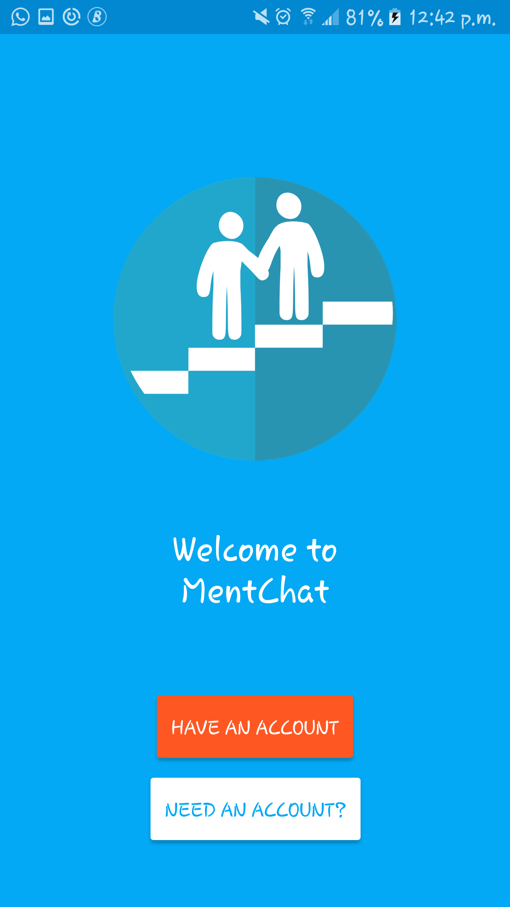
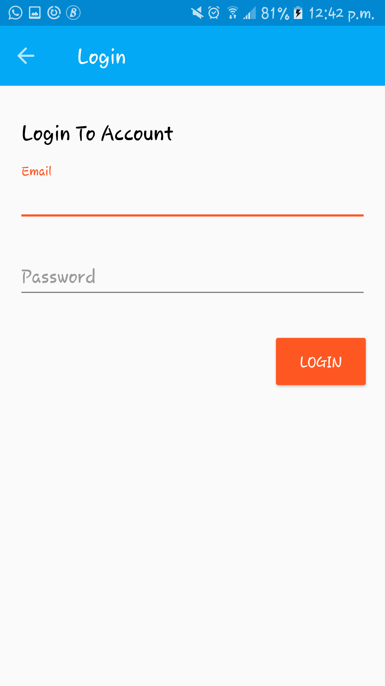
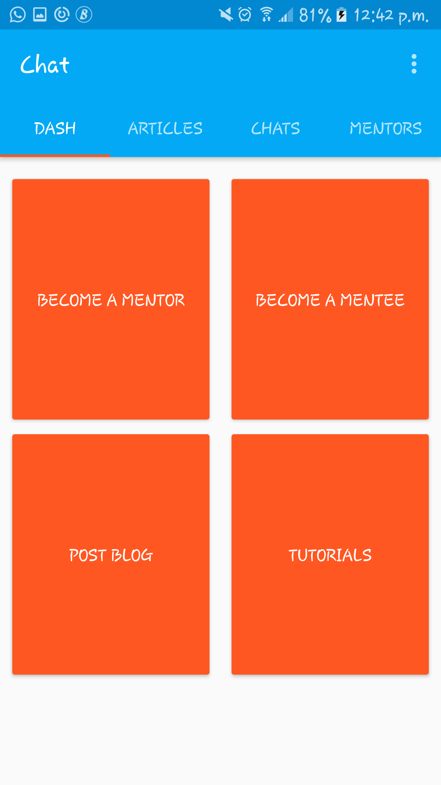
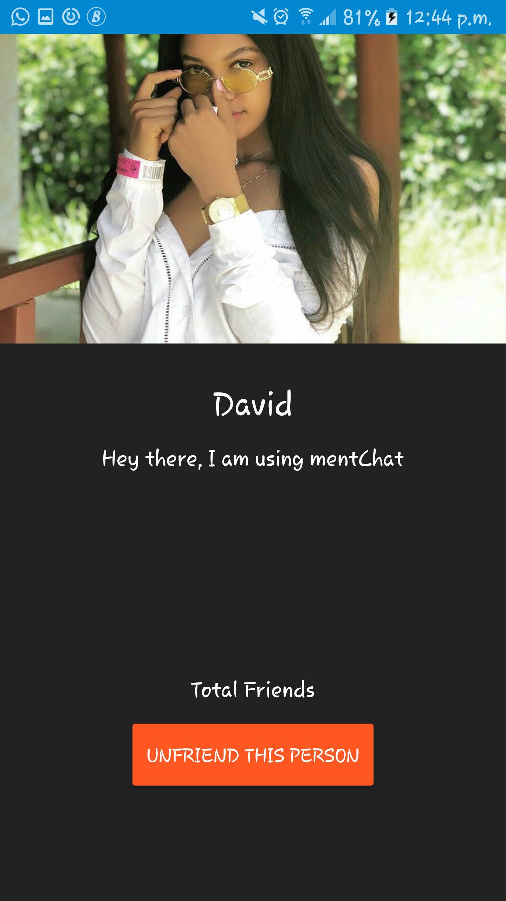
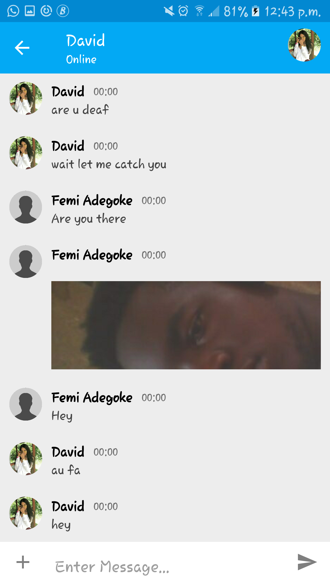
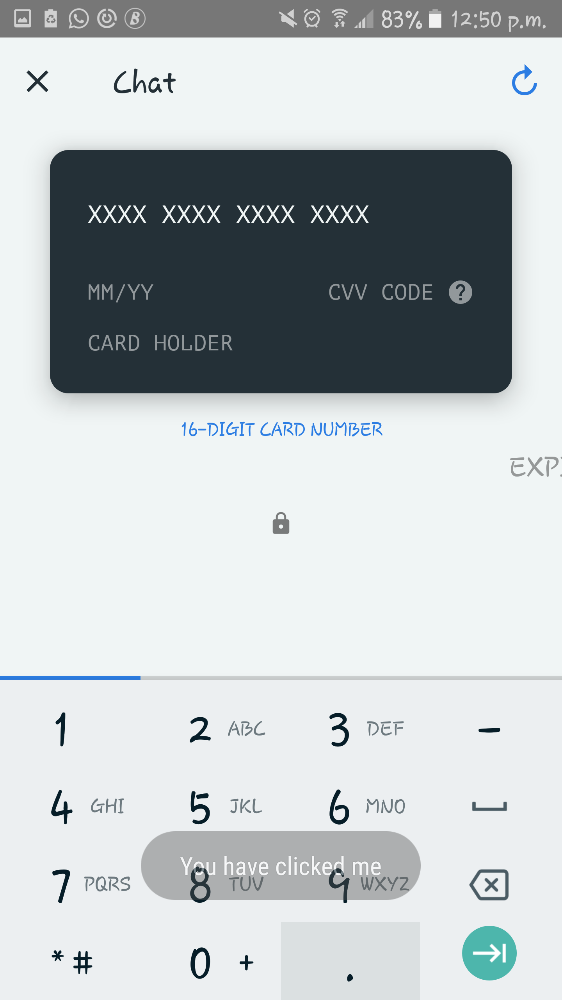

MentorChat is a chat application for mentors and mentees, where mentees will have access to mentors in a particular field for a token per month, after which the mentees will get paid for successful and useful answers

#### Usage
 To get on fast, use the following credentials
 - email: adegokefemi17@gmail.com
 - password: password

#### Features
 - Landing page
   
 - Login
   
 - Dashboard
   
 - Chats
   
 - Profile
   
 - Chat Page
   
 - Payment
   

#### Apis
  - I used africastalking payment api
  - I used Firebase Storage, database, authentication, cloud-messaging
  - I used Retrofit for network calls

